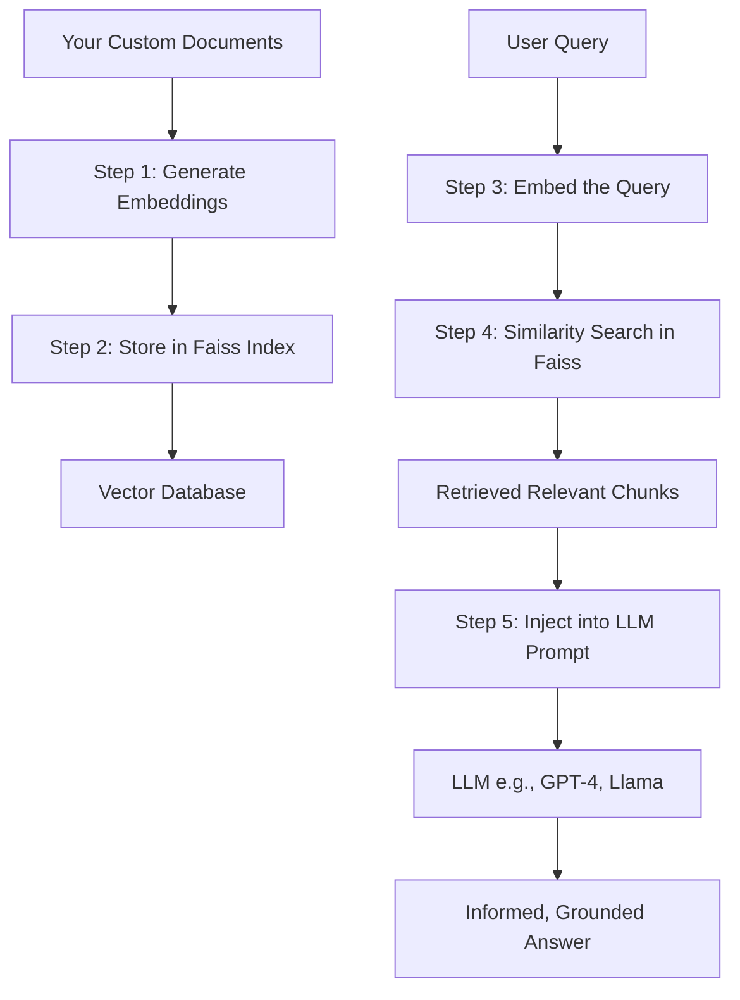

Of course! This is a fantastic question that sits at the heart of building modern, scalable LLM applications. Let's break it down from fundamental concepts to practical usage.

### 1. What is the Objective Behind Using Embeddings?

At its core, the objective is to **represent complex, unstructured data (like text, images, audio) in a numerical form that a computer can understand and compare.**

Think of it like this: you can't do math on the word "king" or "queen." But if you can represent them as vectors (lists of numbers) in a high-dimensional space (e.g., 384 or 1536 dimensions), you can perform mathematical operations on them.

**Key Properties of Good Embeddings:**
*   **Semantic Meaning:** Words, sentences, or documents with similar meanings are located close to each other in the vector space.
    *   Example: The vectors for "canine" and "dog" will be very close.
    *   Example: The vector for `King - Man + Woman` will be very close to the vector for `Queen`.
*   **Dimensionality Reduction:** They compress the vast, sparse representation of language (like one-hot encoding) into a dense, meaningful vector of fixed length.

**Why do we need this?** Because it allows us to use efficient mathematical techniques for **search, clustering, and recommendation**. Instead of comparing words character-by-character, we compare their vector representations for semantic similarity.

---

### 2. What is Faiss, and How Do You Use It?

**Faiss** (Facebook AI Similarity Search) is a powerful open-source library developed by Facebook AI Research. Its sole purpose is to perform **fast similarity search and clustering of dense vectors.**

Imagine you have a million text paragraphs, each converted into a 768-dimensional vector. If you get a new query and want to find the most similar paragraphs, a naive approach would be to compare the query vector to all one million vectors (a "brute-force" search). This is incredibly slow.

**Faiss solves this with two main strategies:**

1.  **Indexing:** It pre-processes the vectors into efficient data structures called **indexes**. This is like creating a smart catalog for your library of vectors.
2.  **Approximate Nearest Neighbor (ANN) Search:** Instead of guaranteeing the *exact* closest vectors, Faiss trades a tiny bit of accuracy for a massive speedup. It finds the *approximate* nearest neighbors, which is almost always good enough for practical applications.

#### How to Use Faiss: A Step-by-Step Example

Let's walk through a simple example in Python.

**Step 1: Installation**
```bash
pip install faiss-cpu  # For CPU version
# or
pip install faiss-gpu  # For GPU version (much faster for large datasets)
```

**Step 2: Create Sample Data and an Index**
```python
import numpy as np
import faiss

# Dimension of our vectors
d = 64
# Number of vectors in our database
nb = 100000
# Number of queries we will perform
nq = 10000

# Create a database of random vectors (in reality, these would be your text embeddings)
np.random.seed(1234)
database_vectors = np.random.random((nb, d)).astype('float32')

# Create a query set
query_vectors = np.random.random((nq, d)).astype('float32')

# Build a Faiss index. We'll use IndexFlatIP for Inner Product (cosine similarity if vectors are normalized)
index = faiss.IndexFlatIP(d)
print(f"Is the index trained? {index.is_trained}") # Yes, for this simple index

# Add the vectors to the index
index.add(database_vectors)
print(f"Number of vectors in the index: {index.ntotal}")
```

**Step 3: Perform a Search**
```python
# We want to find the 4 most similar vectors for each query
k = 4

# Perform the search
# D: distances (similarity scores)
# I: indices of the found neighbors in the database
D, I = index.search(query_vectors, k)

# Let's look at the results for the first query
print(f"Indices of the 4 nearest neighbors for the first query: {I[0]}")
print(f"Similarity scores (higher is better): {D[0]}")
```

**Choosing the Right Index:**
`IndexFlatIP` is simple and exact, but slow for huge datasets (billions of vectors). For production-scale systems, you would use more advanced indexes like:
*   `IndexIVFFlat`: Divides the vector space into partitions (Voronoi cells) for much faster search.
*   `IndexHNSWFlat`: A graph-based index that is very fast and accurate.

---

### 3. How do LLMs Use Faiss and Embeddings? (Retrieval-Augmented Generation - RAG)

This is the most important and practical application. LLMs have a fundamental limitation: they can only answer based on the information they were trained on, and they have a limited "context window" (the number of tokens they can process in one go).

**RAG solves this by giving the LLM access to an external, custom knowledge base at query time.**

Here's the workflow:



**Step-by-Step Breakdown:**

1.  **Indexing Phase (Done Once):**
    *   You take your private documents (PDFs, wikis, help articles) and split them into smaller "chunks."
    *   You use an **Embedding Model** (like OpenAI's `text-embedding-3-small`, or a local one like `all-MiniLM-L6-v2`) to convert each chunk into a vector.
    *   You store all these vectors, along with their corresponding text chunks, in a Faiss index. This is your **searchable knowledge base**.

2.  **Query/Runtime Phase (Happens for every user question):**
    *   A user asks a question: "What is the company's vacation policy?"
    *   You use the *same* embedding model to convert this question into a vector.
    *   You perform a **similarity search** in your Faiss index using this query vector. Faiss quickly returns the text chunks that are most semantically similar to the user's question (e.g., the HR document section on vacation time).
    *   You take these retrieved chunks and **insert them into a prompt** for the LLM. The prompt looks something like:
        ```
        Use the following context to answer the user's question. If you don't know the answer from the context, just say so.

        Context:
        {Retrieved relevant text chunks from Faiss}

        Question: {User's original question}
        Answer:
        ```
    *   You send this full prompt to the LLM (e.g., GPT-4, Claude, or a local Llama model).
    *   The LLM now has the specific, relevant information it needs to generate an accurate, grounded answer. It doesn't have to rely on its training data, which might be outdated or lack your specific information.

### Summary of Benefits in this RAG setup:

*   **Overcomes Knowledge Cut-offs:** The LLM can answer questions about recent events or private data it was never trained on.
*   **Improves Accuracy & Reduces Hallucinations:** By grounding the LLM in retrieved facts, it's less likely to make things up.
*   **Source Citation:** You can easily show the user *which documents* the answer came from, building trust.
*   **Efficiency:** You don't need to fine-tune a massive LLM on your data. Faiss handles the heavy lifting of searching through vast amounts of information efficiently.

In conclusion, **embeddings** are the numerical representation of meaning, and **Faiss** is the high-performance engine that finds similar meanings in a massive collection. Together, they form the backbone of the RAG pattern, which is the standard way to give Large Language Models access to custom, private, and up-to-date information.
